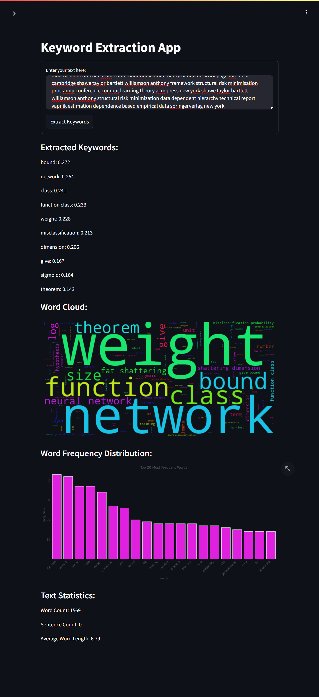

# Keyword Extraction



## Project Overview

The Keyword Extraction project is a natural language processing application that identifies and extracts key terms from input text. This project uses TF-IDF (Term Frequency-Inverse Document Frequency) and other text analysis techniques to generate keyword insights. It provides a user-friendly web interface built with Streamlit, allowing users to input text and receive instant keyword extraction results along with additional text analysis visualizations.

This project demonstrates the application of natural language processing and machine learning in creating a practical tool for content analysts, researchers, and anyone interested in text analysis. It serves as an excellent example of an end-to-end NLP project, from text preprocessing and keyword extraction to deploying a web application with multiple hosting options.

This project is inspired by various NLP projects in the field of text analysis and information retrieval. It aims to showcase the practical application of these techniques in a user-friendly manner.

## Table of Contents

1. [Dataset](#dataset)
2. [Model Training](#model-training)
3. [Streamlit Application](#streamlit-application)
4. [Deployment Options](#deployment-options)
5. [File Structure](#file-structure)
6. [Usage](#usage)
7. [License](#license)

## Dataset

The dataset used for this project is not included in the repository. The application is designed to work with user-provided text input for keyword extraction.

## Model Training

The keyword extraction model uses TF-IDF vectorization, which is trained on-the-fly with the user's input. The `keywords-tfidf-vectorizer.joblib` and `keywords-feature-names.joblib` files contain the pre-trained vectorizer and feature names, respectively. The `Keyword_Extraction.ipynb` notebook in the root directory provides details on the model training process.

## Streamlit Application

The Streamlit application is defined in `app/app.py`. It provides a user interface for inputting text and viewing the extracted keywords, word cloud, and word frequency distribution.

## Deployment Options

There are several ways to deploy and use this application:

1. **Run Locally**:
   - Clone the repository:
     ```
     git clone https://github.com/pouryare/keyword-extraction.git
     cd keyword-extraction/app
     ```
   - Create a virtual environment: 
     ```
     python -m venv venv
     source venv/bin/activate  # On Windows use `venv\Scripts\activate`
     ```
   - Install requirements: `pip install -r requirements.txt`
   - Run the Streamlit app: `streamlit run app.py`
   - Open a web browser and go to `http://localhost:8501`

2. **Use Docker**:
   - Install [Docker](https://docs.docker.com/get-docker/) on your machine.
   - Pull the image from Docker Hub: 
     ```
     docker pull pouryare/keyword-extraction:latest
     ```
   - Run the container: 
     ```
     docker run -p 8501:8501 pouryare/keyword-extraction:latest
     ```

   Alternatively, you can build the image locally:
   - Navigate to the `app` directory
   - Build the Docker image: 
     ```
     docker build -t keyword-extraction:latest .
     ```
   - Run the container: 
     ```
     docker run -p 8501:8501 keyword-extraction:latest
     ```

3. **Deploy on Heroku**:
   - Create a Heroku account and install the [Heroku CLI](https://devcenter.heroku.com/articles/heroku-cli).
   - Login to Heroku: `heroku login`
   - Create a new Heroku app: `heroku create keyword-extraction`
   - Add the following buildpacks:
     ```
     heroku buildpacks:add --index 1 heroku/python
     heroku buildpacks:add --index 2 https://github.com/heroku/heroku-buildpack-apt
     ```
   - Ensure that `Procfile` and `setup.sh` are in the `app/` directory before deploying.
   - Deploy the app: `git push heroku main`
   - Open the app: `heroku open`

4. **Deploy on AWS EC2**:
   - Launch an EC2 instance and SSH into it.
   - Install required dependencies:
     ```
     sudo yum update -y
     sudo yum install git python3 python3-pip -y
     ```
   - Clone the repository and navigate to the `app` directory.
   - Install the required Python packages: `pip3 install -r requirements.txt`
   - Run the Streamlit app: `streamlit run app.py`
   - Configure security groups to allow inbound traffic on port 8501.

5. **Deploy on Google Cloud Platform**:
   - Set up a [Google Cloud account](https://cloud.google.com/) and create a new project.
   - Install the [Google Cloud SDK](https://cloud.google.com/sdk/docs/install).
   - Make sure `app.yaml` is in the `app/` directory before deploying.
   - Initialize your app: `gcloud app create`
   - Deploy the app: `gcloud app deploy`
   - Access your app: `gcloud app browse`

6. **Deploy on Microsoft Azure**:
   - Set up an [Azure account](https://azure.microsoft.com/).
   - Install the [Azure CLI](https://docs.microsoft.com/en-us/cli/azure/install-azure-cli).
   - Create a resource group and app service plan.
   - Create a web app: `az webapp create --resource-group myResourceGroup --plan myAppServicePlan --name keyword-extraction --runtime "PYTHON|3.7"`
   - Configure GitHub deployment: `az webapp deployment source config --name keyword-extraction --resource-group myResourceGroup --repo-url https://github.com/pouryare/keyword-extraction.git --branch main --manual-integration`

## File Structure
```
keyword-extraction/
├── app/
│   ├── app.py
│   ├── app.yaml
│   ├── Dockerfile
│   ├── keywords-feature-names.joblib
│   ├── keywords-tfidf-vectorizer.joblib
│   ├── Procfile
│   ├── requirements.txt
│   ├── setup.py
│   └── setup.sh
├── Keyword_Extraction.ipynb
├── README.md
└── screenshot.png
```

## Usage

1. Open the application (either locally or on a deployed platform).
2. Enter your text in the input field provided.
3. Click the "Extract Keywords" button to view the results.
4. Explore the extracted keywords, word cloud, and word frequency distribution.

## License

This project is licensed under the MIT License. The MIT License is a permissive open-source license that allows for reuse of the software with minimal restrictions. It permits users to use, copy, modify, merge, publish, distribute, sublicense, and/or sell copies of the software, provided that the original copyright notice and permission notice are included in all copies or substantial portions of the software.

For the full license text, please refer to the [MIT License](https://opensource.org/licenses/MIT) page.

---

This project demonstrates the application of natural language processing in creating a keyword extraction tool with a web application interface. It serves as an excellent example of an end-to-end NLP project with practical applications in text analysis and information retrieval.

The project is inspired by and builds upon various NLP projects in the fields of text mining and keyword extraction. It aims to provide a practical, user-friendly implementation of these techniques for educational and practical purposes.

For any issues or suggestions, please open an issue on the [GitHub repository](https://github.com/pouryare/keyword-extraction).
